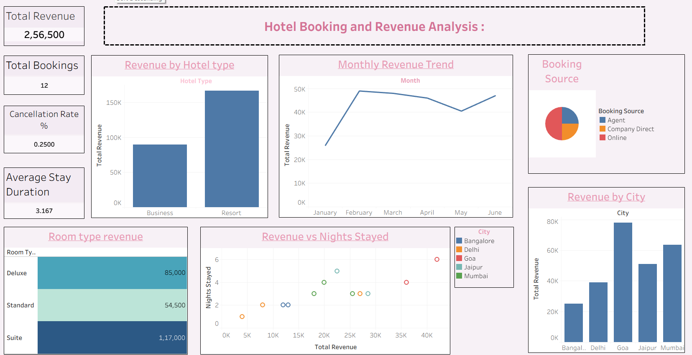
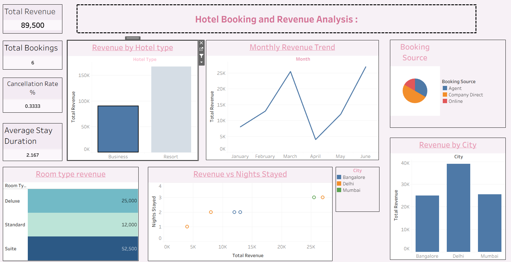

# Hotel-Booking-Analysis
Hotel Booking Analysis using Tableau

## Project Overview
This project analyzes hotel booking data using Tableau to identify booking trends, cancellation patterns, customer behavior, and occupancy insights.

## Tools Used
- Tableau
- Excel
- Data Visualization

## Key Insights
- Booking cancellation trends
- Customer segmentation
- Occupancy analysis
- Revenue-related insights

## Project File
Hotel_booking Analysis project.twbx

## Dashboard Screenshots

### Screenshot 1

### Screenshot 2

